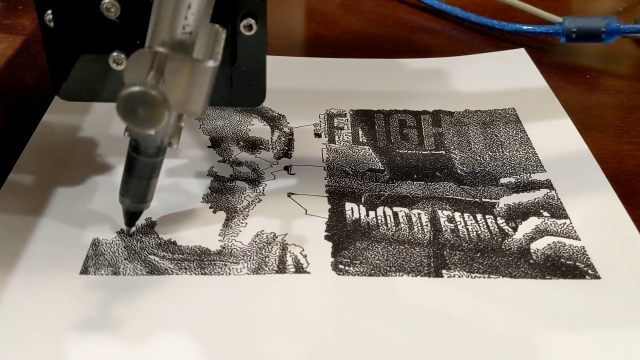
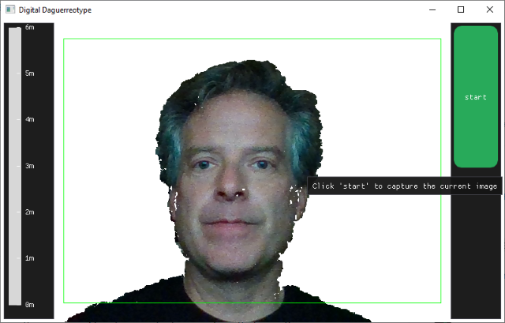
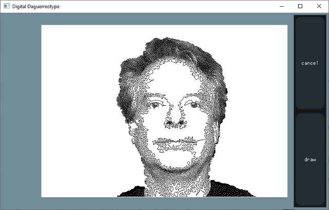
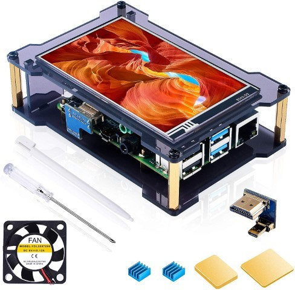
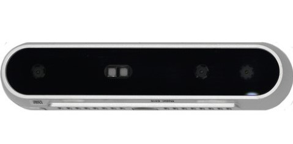
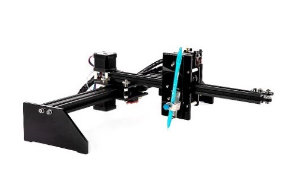

# Digital-Daguerreotype
An application for the Raspberry Pi that will capture an image and convert it to a black and white image made up from a single continuous line (TSP art) then sends that as gcode to an attached CNC device. The Backinmaker ST-2039 drawing CNC was a great target as you get a copy of the picture to take with you.

The user interface shows a live feed from the camera until you press the 'start' button. At that point, it freezes the frame and converts it to the TSP art and displays that. The user can then press the 'draw' button to have it sent to the CNC machine for output.

# General logic in software
1.	Use Intel RealSense to extract foreground and remove background
1.	Project the extracted foreground to touch screen
1.	On button press, capture image and project captured image
1.	Generate a TSP tour for the image
    1.	Increase the brightness to blow out some of the highlights in the face
    1.	Convert the image to grayscale
    1.	Perform Stucki halftoning to get a nice dithered image in black and white
    1.	Collect the positions of all the black pixels
    1.	Use Concorde to generate a 'Quick Boruvka' + 'Lin-Kernighan' tour of all the pixels
        1.	Quick Boruvka is very fast but isn't visually appealing
        1.	Following it with a few iterations of Lin-Kernighan further refines the path and can be time limited. 5 seconds seemed to be sufficient to remove artifacts in Quick Boruvka.
1.	Generate gcode from tour
1.	Output gcode to CNC device

# Hardware used

I used a Raspberry Pi 4 with 4GB of RAM but it is using less that 250 MB so a smaller version should be fine. To preview the image and provide a way for the user to interact, I added a 4" touch screen. You will need to enable the OpenGL driver on your Raspberry Pi.

To capture the image and make removing the background easy, I used an Intel Realsense D415 camera. It would be fairly easy to modified it to use any attached camera and not bother removing the background.

My original  intent was to build a CNC Etch-A-Sketch and output the TSP art to that. To test the software before I built the CNC Etch-A-Sketch, I used a Bachinmaker ST-2039 with the pen attachment. I found everyone liked getting a print out of their picture that they could take with them so abandon the CNC Etch-A-Sketch idea. 

# Required software libraries

In addition to the source in this repo, you also need some additional libraries to get a working project.

1.	The Intel RealSense SDK for collecting video and depth data
1.	OpenCV for image processing
1.	Dear ImGui (immediate mode GUI library)
1.	Glfw 3.3 for OpenGL
1.	Concorde (Traveling Salesman toolset) specifically the linkern command line tool

Install and/or build them as per their individual instructions.

As a long time Windows developer, I found it easiest to do the original development on Windows as it has better development and debugging tools. It will build and run on Windows other than outputting the gcode to the CNC. The included Visual Studio project will facilitate properly building the application for Windows.

On the Raspberry Pi, the included CMakeLists.txt will build the application once all required dependencies are installed.

